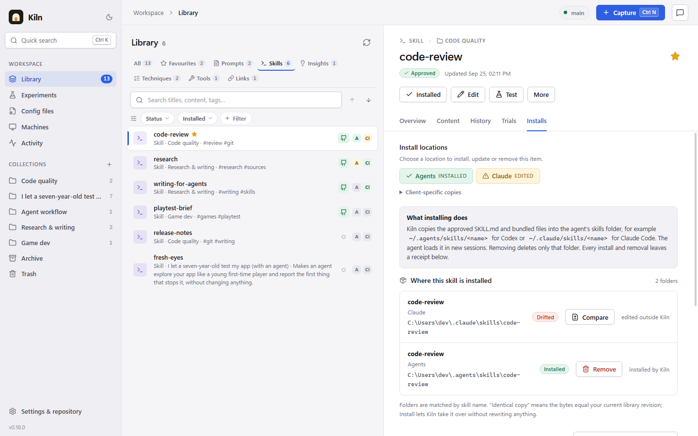
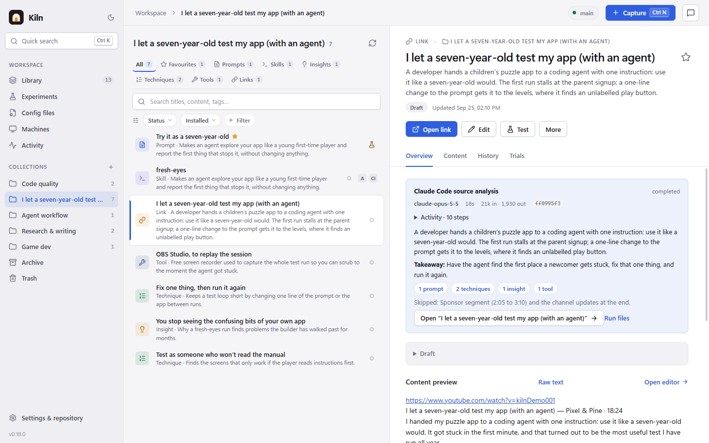
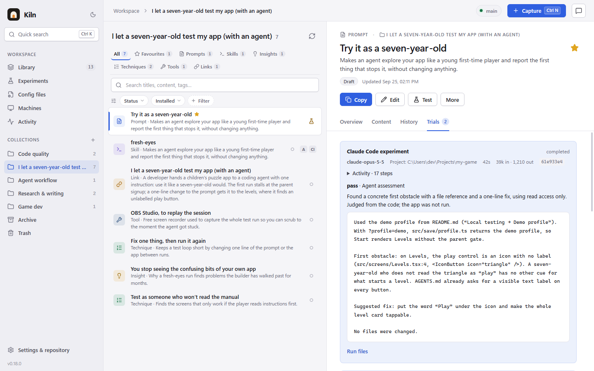
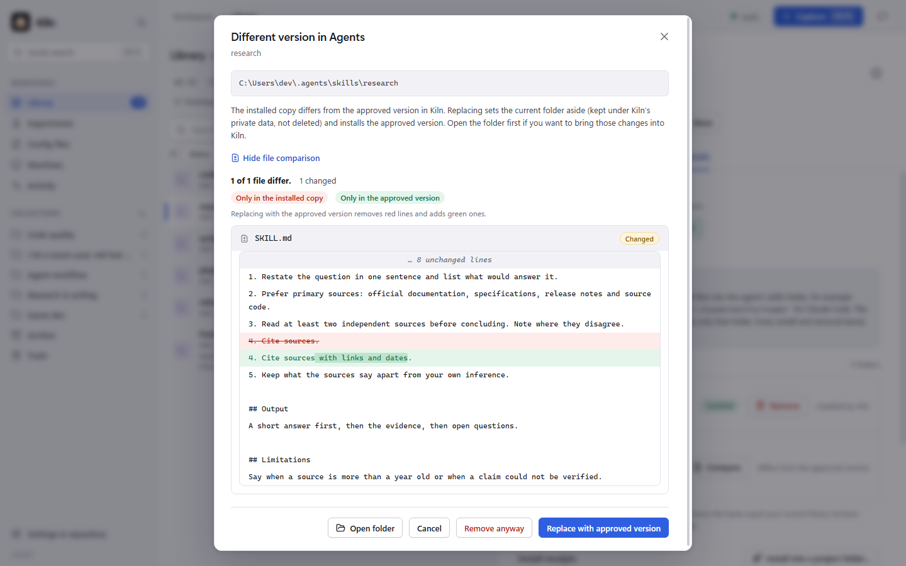
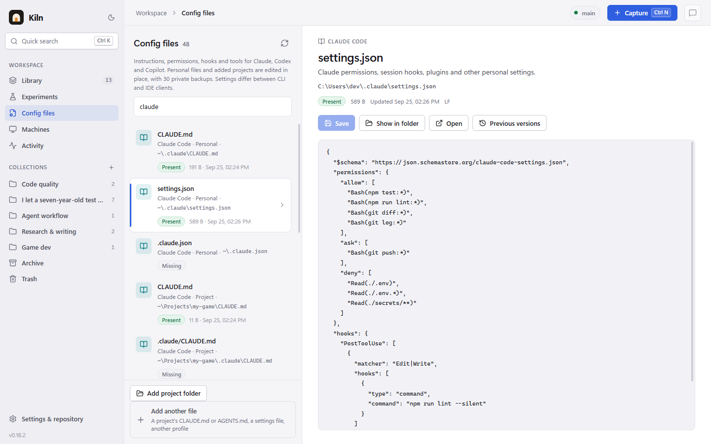

<p align="center"></p>

<p align="center"><a href="https://ko-fi.com/wallxack"></a></p>

# Kiln

Kiln is a free, open-source desktop app and CLI for keeping, testing and installing coding-agent prompts, skills and agents for Claude Code, Codex and GitHub Copilot. Test an exact revision on your own project, approve it, and install that approved copy wherever your agents look. It runs on Windows; the macOS and Linux builds are new and untested.

**[Website](https://wallxack.github.io/kiln/)** · **Download: [Windows](https://github.com/waLLxAck/kiln/releases/download/v0.19.1/Kiln.Setup.0.19.1.exe) · [macOS](https://github.com/waLLxAck/kiln/releases/download/v0.19.1/Kiln-0.19.1-arm64.dmg) · [Linux](https://github.com/waLLxAck/kiln/releases/download/v0.19.1/Kiln-0.19.1-x86_64.AppImage)** · [All releases](https://github.com/waLLxAck/kiln/releases) · [Report an issue](https://github.com/waLLxAck/kiln/issues) · **[❤️ Sponsor](https://ko-fi.com/wallxack)**

## Screenshots



One skill, a switch per install location, and every folder it's in, including a copy edited outside Kiln.

| | |
| --- | --- |
|  |  |
| A video distilled into a prompt, techniques, an insight and a tool, each linked to its minute. | The prompt tested read-only on your own project, with the agent's verdict for that exact revision. |
|  |  |
| An older copy found in another folder, compared with the approved version. | Agent instructions, permissions and hooks in one editor, with previous versions. |

Screenshots of Kiln on Windows with a made-up library; the agent's replies in them are scripted. [All screenshots and how they're made](docs/screenshots/).

## What it does

- **One library** for prompts, skills and agent definitions, with revision history, collections, search and tags. Import the skills you already have as drafts.
- **An install switch per location** (personal folders and enrolled projects) for each skill, with every copy shown, including ones edited outside Kiln, and a line-by-line comparison against the approved version.
- **Capture** text, links, images and files, and **distill a YouTube video** into prompts, techniques, insights and tools, each linked to its minute.
- **Experiments**: run an exact revision read-only on your own project with Codex or Claude Code, and keep the output and the agent's pass/fail/uncertain verdict with that revision.
- **Approval** pins an exact revision and publishes it to your own Kiln repository on GitHub. Only approved revisions are installed; new edits become drafts.
- **Config files**: agent instructions, permissions, MCP settings, hooks and shell profiles in one editor, with syntax checks and previous versions.
- **A CLI** (`kiln`, from a source build) with JSON results, using the same library and approval rules as the desktop app.
- **No API key**: agent runs use your existing, signed-in Codex or Claude Code CLI and its account usage. Editing, approval and installation do not call a model.

The [user guide](docs/GUIDE.md) covers every feature in detail, along with limits and product boundaries.

## Download

Kiln 0.19.1 is on the [releases page](https://github.com/waLLxAck/kiln/releases), with earlier versions, release notes and `SHA256SUMS.txt`. See [what changed in 0.19.1](docs/releases/0.19.1.md).

| Platform | File | Status |
| --- | --- | --- |
| Windows (x64) | [`Kiln.Setup.0.19.1.exe`](https://github.com/waLLxAck/kiln/releases/download/v0.19.1/Kiln.Setup.0.19.1.exe) | Supported |
| macOS, Apple silicon | [`Kiln-0.19.1-arm64.dmg`](https://github.com/waLLxAck/kiln/releases/download/v0.19.1/Kiln-0.19.1-arm64.dmg) (or [`.zip`](https://github.com/waLLxAck/kiln/releases/download/v0.19.1/Kiln-0.19.1-arm64.zip)) | New, untested |
| macOS, Intel | [`Kiln-0.19.1-x64.dmg`](https://github.com/waLLxAck/kiln/releases/download/v0.19.1/Kiln-0.19.1-x64.dmg) (or [`.zip`](https://github.com/waLLxAck/kiln/releases/download/v0.19.1/Kiln-0.19.1-x64.zip)) | New, untested |
| Linux (x64) | [`Kiln-0.19.1-x86_64.AppImage`](https://github.com/waLLxAck/kiln/releases/download/v0.19.1/Kiln-0.19.1-x86_64.AppImage), [`kiln_0.19.1_amd64.deb`](https://github.com/waLLxAck/kiln/releases/download/v0.19.1/kiln_0.19.1_amd64.deb) or [`Kiln-0.19.1-x64.tar.gz`](https://github.com/waLLxAck/kiln/releases/download/v0.19.1/Kiln-0.19.1-x64.tar.gz) | New, tried on one Arch desktop |

The macOS builds have only been started on CI runners; the Linux build has been tried on one Arch Linux desktop. Please [report what breaks](https://github.com/waLLxAck/kiln/issues), or [build from source](#build-from-source).

- **Windows:** the installer is unsigned. If SmartScreen warns you, choose **More info**, then **Run anyway**.
- **macOS:** drag Kiln to Applications. It is not notarized, so Gatekeeper blocks the first launch: right-click it and choose **Open** (on macOS 15 and later, **Open Anyway** in System Settings → Privacy & Security), or run `xattr -dr com.apple.quarantine /Applications/Kiln.app`.
- **Linux:** `chmod +x Kiln-0.19.1-x86_64.AppImage` and run it. It needs FUSE 2: `sudo pacman -S fuse2` (Arch), `sudo apt install libfuse2` (`libfuse2t64` on Ubuntu 24.04), or run it with `--appimage-extract-and-run`. The tar.gz needs no FUSE: unpack it and run `kiln-workbench`. Or install the package with `sudo apt install ./kiln_0.19.1_amd64.deb`. If it exits with a sandbox error, start it with `--no-sandbox`.

You also need Git and the [GitHub CLI](https://cli.github.com/) (`gh`), signed in; first launch creates or opens your Kiln repository on GitHub. Agent runs need the official Codex or Claude Code CLI, and video distillation needs [`yt-dlp`](https://github.com/yt-dlp/yt-dlp) on PATH. [Install notes in full](docs/GUIDE.md#installing).

## Build from source

Requires Node.js 24 LTS (22.16 or newer), npm and Git.

```sh
git clone https://github.com/waLLxAck/kiln.git
cd kiln
npm ci
npm run build
npm run dev          # run the desktop app
npm run cli -- --help
```

Installers are built on their own platform with `npm run dist:win`, `npm run dist:mac` or `npm run dist:linux`. See [DEVELOPMENT.md](docs/DEVELOPMENT.md) for the workspace layout, tests, releases and diagnostics, and [ARCHITECTURE.md](docs/ARCHITECTURE.md) for how the code fits together.

## Contributing

Issues and pull requests are welcome. [Open an issue](https://github.com/waLLxAck/kiln/issues) for bugs, questions or ideas; for a bug, include the steps, what you expected and what happened. Keep pull requests focused, run `npm run check` and `npm test` first (and `npm run test:desktop` for desktop UI changes), and describe user-facing changes in [docs/GUIDE.md](docs/GUIDE.md).

## Support

Kiln is free and built by one developer. If it saves you time, you can [support it on Ko-fi](https://ko-fi.com/wallxack). Starring the repository, reporting issues and telling people about it help too. See the [support page](https://wallxack.github.io/kiln/support/).

## License

[MIT](LICENSE). Third-party notices are in [THIRD_PARTY.md](THIRD_PARTY.md).
